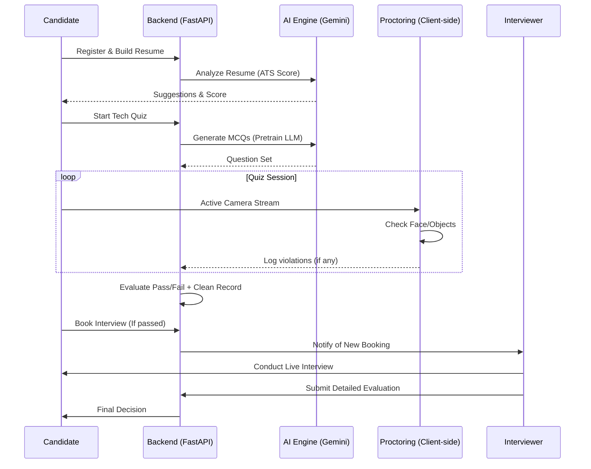

# 🚀 HireMate: AI-Powered Recruitment Platform

HireMate is a state-of-the-art recruitment platform designed to streamline the hiring process using Artificial Intelligence. It provides a seamless experience for candidates, recruiters, and interviewers through automated skill assessments, AI-driven resume analysis, and structured interview workflows.

---

## 👥 User Roles: Detailed Breakdown

### 1. 🎓 THE CANDIDATE (Job Seeker)
The Candidate is the primary user of the platform. Their journey is designed to be highly interactive and automated.

#### **Core Features & How They Work:**

*   **Progressive Resume Builder**:
    *   **Workflow**: The candidate enters their background information in sections (Personal, Education, Experience, Skills, Projects, Certificates).
    *   **Auto-Save**: Implements a **1-second debounce** mechanism. As the user types, the system waits for 1 second of inactivity before automatically calling the `POST /resume/save-section` API.
    *   **Progress Tracking**: A real-time progress bar shows the completion percentage. Sections are marked with visual icons (Check/Loading) to indicate sync status.
 

*   **AI Resume Analysis**:
    *   **ATS Scoring**: The backend parses the resume and scores it against "Applicant Tracking System" standards (formatting, keywords, structure).
    *   **Gap Analysis**: AI identifies missing skills based on the candidate's target job role.
    *   **Keyword Optimization**: Suggests specific industry-standard keywords to improve visibility.

*   **AI-Proctored Technical Assessment**:
    *   **Role Logic**: To stop cheating and verify skills, candidates must pass a proctored quiz before they can book an interview.
    *   **Preparation Phase**: Includes a camera/microphone check and a "Gaze Calibration" step to establish a baseline for eye-tracking.
    *   **Real-time Monitoring**:
        *   **Eye Tracking**: Uses **MediaPipe Face Mesh** to calculate eye aspect ratios and iris position. If the candidate looks away from the screen for too long, a warning is triggered.
        *   **Object Detection**: Uses **TensorFlow.js (COCO-SSD)** to identify mobile phones, books, or extra persons in the frame.
        *   **Tab Tracking**: JavaScript listeners detect if the user switches browser tabs or leaves the window.
    *   **Termination Rules**: 5 minor warnings or 1 major violation (like a phone being detected) results in **instant termination** of the test.

*   **Interview Booking**:
    *   **Workflow**: Once the quiz is passed with a "Clean Record," the candidate gains access to the interviewer's calendar.
    *   **Scheduling**: They can select a slot that matches the interviewer's availability and receive a Zoom link automatically.

---

### 2. 👨‍🏫 THE INTERVIEWER (Technical Expert)
The Interviewer is responsible for final validation and human-centric evaluation.

#### **Core Features & How They Work:**

*   **Automated Dashboard**:
    *   **Statistics**: View total interviews conducted, average candidate ratings, and upcoming sessions.
    *   **Recent Activity**: A feed showing lately completed interviews and pending feedback reports.

*   **Profile & Availability Management**:
    *   **Expertise Tagging**: Interviewers tag themselves with skills (e.g., Python, React, Cloud Architecture).
    *   **Smart Calendar**: Integrated with a custom availability system where they set "Preferred Slots." Candidates can only book within these pre-approved windows.

*   **Live Interview & Evaluation**:
    *   **Zoom Integration**: Automatic meeting generation.
    *   **Unified Evaluation UI**: During or after the interview, the interviewer uses a structured form to rate:
        *   Technical Skills (1-10)
        *   Communication (1-10)
        *   Problem Solving (1-10)
        *   Honesty Score (Calculated based on AI proctoring logs from the earlier quiz phase).
    *   **Recommendation Engine**: They must select one of: `Strong Hire`, `Hire`, `Maybe`, or `No Hire`.

---

### 3. 🏢 THE RECRUITER (HR / Hiring Manager)
The Recruiter manages the pipeline and makes the final hiring decisions.

#### **Core Features & How They Work:**

*   **Job Post Management**:
    *   **Posting**: Create job listings with detailed requirements, salary ranges, and technical tags.
    *   **Management**: Open, close, or update job status directly from the dashboard.

*   **Applicant Intelligence**:
    *   **AI Ranking**: Candidates are ranked based on their **AI Resume Score** and **Quiz Performance**.
    *   **Proctoring Audit**: Recruiters can view "Proctoring Logs" (including snapshots taken during violations) to verify the integrity of a candidate's test score.
    *   **Stage Tracking**: Move candidates through stages: `Applied` -> `Quiz Passed` -> `Interview Scheduled` -> `Evaluated` -> `Hired`.

---

### 4. 🛡️ THE ADMIN (System Administrator)
The Admin ensures the platform's stability and oversees all global activity.

#### **Core Features & How They Work:**

*   **Global Analytics**:
    *   **Aggregated Stats**: High-level view of total users (divided by role), active jobs, and cumulative application counts.
    *   **System Health**: Monitoring API usage and AI model performance (latency/success rates).

*   **User & Database Management**:
    *   **CRUD Operations**: Full control over all profiles. Can reset passwords, delete users, or override status.
    *   **Job Auditing**: Review all posted jobs to ensure they comply with platform standards.

---

## 🛠️ Technical Implementation Summary

### **How the data flows:**
1.  **Frontend (Next.js)** captures user interaction and sends it to **FastAPI**.
2.  **FastAPI** authenticates the user via **Supabase Auth**.
3.  **Business Logic** (Quiz Generation, Resume Parsing) is handled by **Google Gemini AI**.
4.  **On-device AI** (MediaPipe/TensorFlow) runs in the user's browser for privacy and speed during proctoring.
5.  **Supabase PostgreSQL** stores all relations, logs, and profile data in real-time.

---

## � System Workflow Diagram

