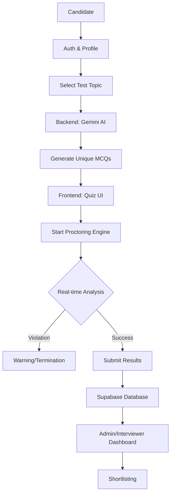

# HireMate Project Review: AI-Powered Recruitment & Proctoring Platform

## 1. Project Motivation
The modern recruitment landscape faces several critical challenges:
- **Efficiency Bottlenecks**: HR teams are often overwhelmed by thousands of resumes for a single position, making manual screening nearly impossible and prone to fatigue.
- **Subjective Bias**: Human recruiters may unconsciously let personal biases affect candidate screening and initial evaluations.
- **Remote Integrity**: With the rise of remote hiring, ensuring the integrity of online technical assessments is a major concern. Traditional methods are either too invasive or easily bypassed.
- **Candidate Experience**: Long feedback loops and fragmented application processes lead to high candidate drop-off rates.

**HireMate** was born to solve these issues by creating a seamless, AI-integrated ecosystem that automates the recruitment funnel from resume building to proctored technical assessments.

---

## 2. Project Description
HireMate is a comprehensive Recruitment Management System (RMS) designed to streamline the hiring process for both candidates and employers. It integrates cutting-edge AI technologies to provide:

- **AI Resume Builder**: A progressive, auto-saving tool that helps candidates create professional profiles with real-time completion tracking.
- **AI Resume Analyzer**: A backend service that scores resumes based on job requirements and provides constructive feedback.
- **AI Quiz Engine**: Dynamically generates technical MCQs using Large Language Models (LLMs) tailored to specific topics and difficulty levels.
- **Advanced AI Proctoring**: A browser-based monitoring system that detects cheating behaviors in real-time without requiring specialized software installation.

---

## 3. Findings & Results
During the development and testing of HireMate, several key milestones were achieved:
- **Real-Time Proctoring Precision**: Successfully implemented a multi-model proctoring engine that accurately detects gaze deviation, multiple faces, and unauthorized objects (phones) with minimal latency (under 100ms).
- **Dynamic Content Generation**: The integration with Google Gemini proved highly effective, generating high-quality, relevant technical questions on the fly, reducing the need for static question banks.
- **User Engagement**: The progressive resume builder significantly improved the completion rate by providing immediate feedback and preventing data loss through debounced auto-saving.
- **Architecture Scalability**: The combination of FastAPI (backend) and Next.js (frontend) with Supabase ensures the platform can scale to handle many concurrent users and data-intensive AI operations.

---

## 4. Future Plans and Enhancements
HireMate is designed to evolve. Upcoming features include:
- **Resume Templates**: Multiple professional designs and direct PDF/Word export functionality.
- **AI Video Interviews**: Analyzing candidate sentiment, confidence, and technical explanations using speech-to-text and tone analysis.
- **Gamified Assessments**: Interactive coding challenges in a sandbox environment.
- **Enhanced ATS Integration**: Improved compatibility with existing Applicant Tracking Systems (ATS) through standard JSON/XML exports.
- **Offline Support**: Allowing candidates to continue resume building or test preparation without a stable internet connection.

---

## 5. System Flow & Technical Architecture

### Application Flow
The system follows a logical progression for both candidates and recruiters:

1. **Authentication**: Secure login/signup via Supabase Auth.
2. **Profile Completion**: Progressive resume building with real-time validation.
3. **Assessment Selection**: Candidates choose a technical language or topic (e.g., Python, React, DevOps).
4. **AI Generation**: Backend triggers Gemini AI to generate a unique set of MCQs.
5. **Proctored Session**:
   - Camera initialization and engine startup (MediaPipe/TF.js).
   - Real-time monitoring of eyes, face presence, and objects.
   - Immediate warnings for violations; automated termination for excessive cheating.
6. **Evaluation**: Automatic scoring and report generation.
7. **Recruiter Review**: Admin dashboard to view candidate scores, proctoring logs, and resume fits.

### Technical Workflow Diagram (Mermaid)

---

## 6. Model Details & How They Work

The "Intelligence" of HireMate is powered by three primary AI layers:

### A. Real-Time Vision Engine (Frontend)
This layer runs entirely in the user's browser for privacy and speed.
- **MediaPipe Face Mesh**:
  - **How it works**: Uses a deep learning model to estimate 468+ 3D face landmarks in real-time.
  - **Usage**:
    - **Gaze Tracking**: We calculate the ratio of the iris center relative to the eye corners. If the ratio stays outside the "normal" range for >1.5s, a "Looking Away" violation is triggered.
    - **Blink/Focus Detection**: Monitors the eye-aspect-ratio (EAR) to check if eyes are closed (sleeping) or looking down too long.
    - **Head Pose**: Calculates the nose position relative to the face outline to detect if the candidate is turning their head to look at another screen or person.
- **TensorFlow.js COCO-SSD**:
  - **How it works**: A pre-trained object detection model (Single Shot MultiBox Detector) optimized for the browser.
  - **Usage**: Specifically filtered to detect subclasses like `cell phone`, `laptop`, and `book`. It runs in parallel with Face Mesh to flag unauthorized devices.

### B. Language Model Layer (Backend)
- **Google Gemini (1.5/2.0/2.5 Flash)**:
  - **How it works**: A state-of-the-art Generative AI model.
  - **Usage**:
    - Receives the test topic and difficulty from the backend.
    - Generates a JSON-formatted list of MCQs including question text, four options, correct index, and an explanation.
  - **Fallback Logic**: If the API fails or the rate limit is hit, the system automatically falls back to a curated robust set of mock questions to ensure zero downtime for the user.

### C. Resume Intelligence
- **Custom Pydantic Schemas & Scoring Logic**:
  - **How it works**: Uses structured data validation to parse complex resume JSON.
  - **Usage**: Calculates completion percentages and matches skill arrays against job descriptions to provide a "Fit Score".
